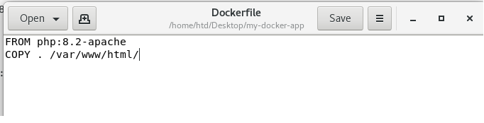
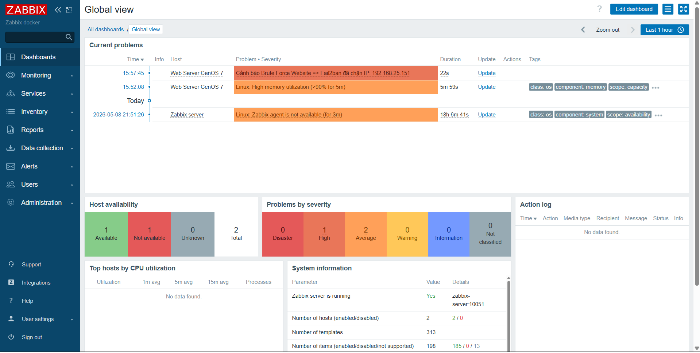
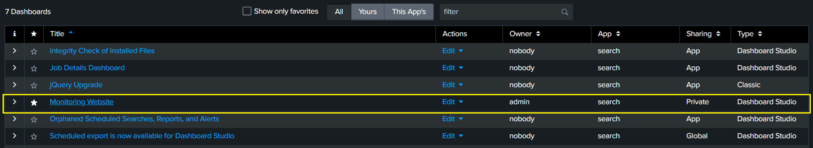
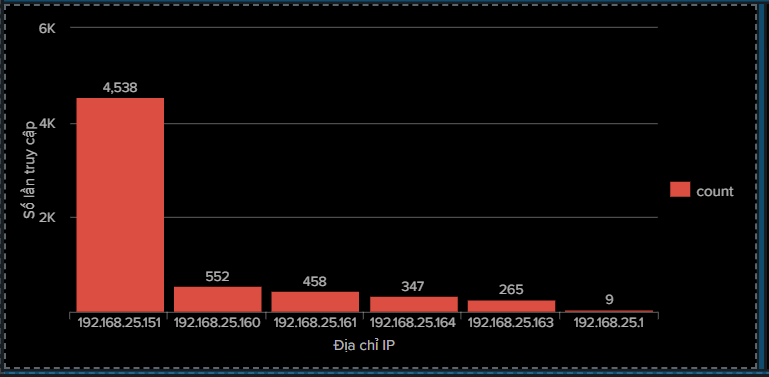
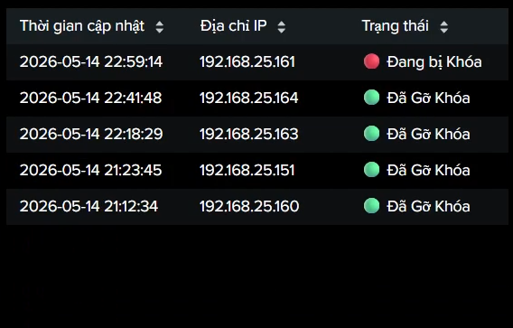
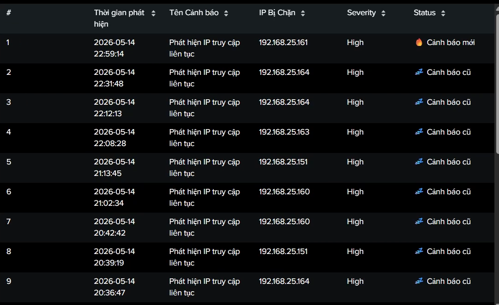

# Xây dựng hệ thống ngăn chặn tấn công Brute-force bằng Fail2ban kết hợp giám sát tập trung bằng Zabbix và Splunk

## 📋 Giới thiệu tổng quan
Dự án này triển khai một hệ thống bảo mật nhằm phát hiện, ngăn chặn và giám sát các cuộc tấn công **Brute-force Login** vào ứng dụng Web chạy trên nền tảng Docker.

Video demo: https://www.youtube.com/watch?v=WFEvLWcn8W4

Hệ thống kết hợp sức mạnh của:
1. **Fail2ban (IPS)**: Tự động phân tích log và ngăn chặn IP tấn công.
2. **Zabbix (Monitoring)**: Giám sát tập trung và cảnh báo thời gian thực khi có sự cố an ninh xảy ra.
3. **Splunk (Monitoring and Alert)**: Trung tâm phân tích chuyên sâu, tập trung hóa log, trực quan hóa xu hướng tấn công và hỗ trợ điều tra số.

## 🏗️ Kiến trúc hệ thống
Hệ thống bao gồm 3 thành phần chính:
*   **Web Server (CentOS 7)**: Chạy ứng dụng Web (PHP/Apache) trong Docker Container. Cài đặt Fail2ban và Zabbix Agent.
*   **Monitoring Server (CentOS 7)**: Chạy Zabbix Server và Splunk Enterprise trong các Docker Container riêng biệt.
*   **Attacker (Kali Linux)**: Sử dụng công cụ Hydra để thực hiện tấn công mô phỏng.


## 🛠️ Công nghệ & Công cụ sử dụng
*   **Infrastructure**: Linux CentOS, Docker, Docker-compose.
*   **Backend**: PHP (Xác thực đăng nhập cơ bản).
*   **Security**: Fail2ban, IPTables (DOCKER-USER Chain).
*   **Monitoring**: Zabbix Server, Zabbix Agent.
*   **SIEM & Log Analytics**: Splunk Enterprise, Splunk Universal Forwarder, SPL (Search Processing Language).
*   **Pentest Tools**: Kali Linux, Hydra.

## 🚀 Các bước triển khai chi tiết

### 1. Triển khai Ứng dụng Web (Docker)
Xây dựng một Web Server đơn giản có chức năng Login để làm mục tiêu tấn công.

*   **Dockerfile:** Sử dụng image `php:8.2-apache`.
*   **index.php:** Xử lý xác thực phía Server-side để sinh log khi đăng nhập thất bại.
*   **Cấu hình Map Log:** Rất quan trọng để Fail2ban và Zabbix có thể đọc được dữ liệu từ Container.

```bash
docker run -d -p 80:80 \
  --name web-security-demo \
  -v /var/log/my-docker-app:/var/log/apache2 \
  my-web-php-image
```

**Viết mã nguồn ứng dụng (PHP)**
  Tạo file `index.php` với logic xác thực cơ bản. Nếu đăng nhập sai, server sẽ trả về chuỗi "LoginFailed" để làm dấu hiệu nhận diện tấn công.
**** 
  Mã nguồn PHP xử lý xác thực và in ra thông báo lỗi.

**Đóng gói với Dockerfile**
  Sử dụng Image `php:8.2-apache` để tích hợp sẵn môi trường chạy Web.
**** 
  Nội dung Dockerfile copy mã nguồn vào thư mục `/var/www/html/`.

**Triển khai bằng Docker Compose**
  Sử dụng Docker Compose để quản lý cổng (Port 80) và ánh xạ thư mục log.
**** 
  Cấu hình `docker-compose.yml`.

### 2. Ngăn chặn tự động với Fail2ban (IPS)
Cấu hình Fail2ban để nhận diện và khóa IP máy Kali ngay khi phát hiện tấn công.

*   **Filter (`/etc/fail2ban/filter.d/web-bruteforce.conf`):** Định nghĩa Regex để bắt các dòng log POST lỗi.
*   **Jail (`/etc/fail2ban/jail.local`):** Thiết lập quy tắc chặn.

```ini
[my-docker-app]
enabled = true
port = http,https
filter = web-bruteforce
logpath = /var/log/my-docker-app/access.log
maxretry = 5
findtime = 60
bantime = 600
action = iptables-allports[name=my-docker-app, chain=DOCKER-USER]
```
*Lưu ý: Sử dụng `chain=DOCKER-USER` để đảm bảo IPTables chặn được traffic đi vào Docker Container.*

**Tạo bộ lọc (Filter)**
 Định nghĩa biểu thức chính quy (Regex) trong file `my-docker-app.conf` để nhận diện các dòng log đăng nhập lỗi từ Docker.
 

  Cấu hình Regex bắt các request "POST" trả về mã "200" (xác thực sai).
  

  Hiển thị danh sách các IP bị ban

### 3. Giám sát & Cảnh báo với Zabbix (Monitoring)
Cấu hình Zabbix để theo dõi file `/var/log/fail2ban.log` và hiển thị cảnh báo.

*   **Item:** Sử dụng `Zabbix agent (active)` để theo dõi từ khóa "Ban" trong log của Fail2ban.
*   **Preprocessing:** Sử dụng Regular Expression `Ban (.*)` để trích xuất duy nhất địa chỉ IP bị chặn.
*   **Trigger:** 
    *   **Problem Expression:** `count(..., 10s) > 0` (Báo động ngay khi có IP bị chặn).
    *   **Recovery Expression:** `nodata(..., 30s) = 1` (Tự động đóng cảnh báo sau 30 giây im lặng).


#### 3.1. Cấu hình Giám sát (Zabbix Agent)
Cài đặt Zabbix Agent trên Web Server để gửi dữ liệu về Zabbix Server.

***Cấu hình Agent Active**
 Chỉnh sửa file `zabbix_agentd.conf`, trỏ IP về Zabbix Server và đặt `Hostname` trùng khớp với cấu hình trên Web giao diện.
****
  Cấu hình IP Zabbix Server.

**** 
  Cấu hình Hostname cho Web Server.


#### 3.2 Thiết lập Giám sát trên giao diện Web Zabbix
Đây là bước quan trọng nhất để hiển thị cảnh báo trực quan cho người quản trị.

***Kiểm tra trạng thái Host**
Đảm bảo Web Server đã được kết nối thành công (ZBX xanh).
****
  Danh sách Host và trạng thái khả dụng.

**Tạo Item đọc Log Fail2ban**
Tạo Item mới để theo dõi file `/var/log/fail2ban.log`. Sử dụng chế độ **Zabbix agent (active)** để đọc log thời gian thực.
Thao tác menu để tạo Item.


  Cấu hình thông số Item: Key log[/var/log/fail2ban.log,"Ban"].
  
**Tiền xử lý dữ liệu (Preprocessing)**
  Sử dụng Regex để lọc lấy duy nhất địa chỉ IP bị chặn từ dòng log dài của Fail2ban.
**** 
  Cấu hình Preprocessing với mẫu `Ban (.*)` và Output `\1`.

**Thiết lập cảnh báo (Trigger)**
 Tạo Trigger để phát báo động đỏ khi có IP bị chặn, sử dụng Macro `{ITEM.VALUE}` để hiển thị IP ngay trên tên cảnh báo. Cấu hình tự động đóng cảnh báo sau 30 giây im lặng.
Thao tác menu để tạo Trigger.


  Cấu hình chi tiết Trigger: Tên, Expression (count) và Recovery expression (nodata).
  

  **Kết quả ta được giao diện như hình khi có cảnh báo xảy ra**

### 4. Giám sát & Cảnh báo với Splunk (Monitoring)
Dữ liệu log từ cả Web Server và Fail2ban được đẩy về Splunk để phân tích và trực quan hóa, cung cấp cái nhìn tổng thể cho đội ngũ an ninh.
* **Phân tích Lưu lượng tấn công**: Biểu đồ Timeline cho thấy sự tăng vọt của các request POST và biểu đồ cột thống kê các IP tấn công nhiều nhất.
* **Phân tích Trạng thái Sự cố**: Bảng dữ liệu thông minh hiển thị IP nào vừa bị chặn (Trạng thái "Mới") và IP nào đã bị chặn từ lâu (Trạng thái "Cũ").

#### 4.1 Cấu hình Giám sát (Splunk Universal Forwarder)
Để đẩy dữ liệu từ **Web Server (Máy 1)** về máy chủ trung tâm, chúng ta cài đặt và cấu hình **Splunk Universal Forwarder (UF)**, một agent siêu nhẹ và hiệu quả.

*   **Bước 1: Cài đặt Splunk UF trên Web Server**
    Sử dụng lệnh `wget` để tải gói cài đặt và `rpm` để cài đặt vào hệ thống.
    ```bash
    # Tải gói cài đặt (phiên bản có thể thay đổi)
    wget -O splunkforwarder.rpm "https://download.splunk.com/products/universalforwarder/releases/9.4.2/linux/splunkforwarder-9.4.2-e9664af3d956.x86_64.rpm"

    # Cài đặt
    rpm -ivh splunkforwarder.rpm
    ```

*   **Bước 2: Cấu hình kết nối và giám sát file**
    Sau khi cài đặt, chúng ta cấu hình UF để trỏ về Splunk Server và chỉ định các file log cần theo dõi.
    ```bash
    # Chạy lần đầu và tạo mật khẩu
    /opt/splunkforwarder/bin/splunk start --accept-license

    # Bật chế độ tự động khởi động agent
    /opt/splunkforwarder/bin/splunk enable boot-start

    # Thêm địa chỉ Splunk Server để gửi dữ liệu đến
    /opt/splunkforwarder/bin/splunk add forward-server <IP_SPLUNK_SERVER>:9997

    # Thêm các file log cần theo dõi vào danh sách

    # Theo dõi log các traffic đến Website
    /opt/splunkforwarder/bin/splunk add monitor /var/log/my-docker-app/access.log

    # Theo dõi log Fail2ban
    /opt/splunkforwarder/bin/splunk add monitor /var/log/fail2ban.log

    # Xử lý phân quyền để Splunk UF có thể đọc được file log
    chmod 755 /var/log/my-docker-app
    chmod 644 /var/log/my-docker-app/access.log
    chmod 644 /var/log/fail2ban.log
    
    # Khởi động lại để áp dụng cấu hình
    /opt/splunkforwarder/bin/splunk restart

    sudo systemctl enable SplunkForwarder
    
    sudo systemctl start SplunkForwarder
    ```

#### 4.2 Thiết lập Giám sát trên giao diện Web Splunk
Tại giao diện Splunk Enterprise, chúng ta sử dụng ngôn ngữ **SPL (Search Processing Language)** để biến dữ liệu thô thành các biểu đồ và cảnh báo có giá trị.
*   **Bước 1: Tạo Dashboard SOC**
Tạo một Dashboard mới tên là **"Monitoring Website"** sử dụng **Dashboard Studio** .


*   **Bước 2: Vẽ biểu đồ "Top IP Tấn Công"**
    Sử dụng lệnh `rex` để trích xuất IP từ `access.log` và `stats` để đếm tần suất.
    ```bash
    source="/var/log/my-docker-app/access.log" 
    | rex field=_raw "^(?<client_ip>\d+\.\d+\.\d+\.\d+)" 
    | where client_ip != "127.0.0.1" 
    | stats count by client_ip 
    | sort - count
    ```
  

*   **Bước 3: Tạo bảng "Trạng thái IP Bị Chặn" (Ban/Unban)**
    Sử dụng logic `stats latest()` để hiển thị trạng thái mới nhất của một IP, kết hợp `eval case()` để thêm icon màu sắc trực quan (🔴/🟢).
    ```bash
    source="/var/log/fail2ban.log" ("Ban" OR "Unban")
    | rex "(?<action>Ban|Unban)\s+(?<ip_address>\S+)"
    | stats latest(action) as status by ip_address
    | eval status_icon = if(status=="Ban", "🔴 Bị khóa", "🟢 Đã gỡ")
    | table ip_address, status_icon
    ```
  

*   **Bước 4: Cấu hình Alert tự động**
  
    Để trực quan hóa và phân loại các sự cố do Fail2ban ghi nhận, chúng ta xây dựng một bảng dữ liệu thông minh trên Dashboard Splunk. Bảng này không chỉ liệt kê các IP bị chặn mà còn tự động cập nhật trạng thái của chúng theo thời gian thực.

    Câu lệnh SPL kết hợp nhiều hàm nâng cao để xử lý dữ liệu:
    * ``rex``: Sử dụng **Regular Expression** để trích xuất ``banned_ip`` từ log thô.
    * ``strftime``: Chuyển đổi định dạng thời gian (Epoch time) sang dạng con người đọc được (Năm-Tháng-Ngày Giờ:Phút:Giây).
    * ``eval Time_Diff = now() - _time``: Tính toán khoảng thời gian trôi qua (tính bằng giây) từ lúc sự kiện xảy ra cho đến thời điểm hiện tại.
    * ``eval Status = case(...)``: Áp dụng logic điều kiện để tự động gán nhãn trạng thái "Mới" (kèm icon 🔥) hoặc "Cũ" (kèm icon 💤) dựa trên việc sự kiện đó có xảy ra trong vòng 2 phút (120 giây) gần nhất hay không.

    ```bash
    source="/var/log/fail2ban.log" ("Ban" OR "Unban")
    | rex "(?<Hanh_dong>Ban|Unban)\s+(?<IP_Address>\d+\.\d+\.\d+\.\d+)"
    | search Hanh_dong="*"
    | stats latest(Hanh_dong) as Status, latest(_time) as Last_Time by IP_Address
    | eval "Thời gian cập nhật" = strftime(Last_Time, "%Y-%m-%d %H:%M:%S")
    | eval "Trạng thái" = case(Status=="Ban", "🔴 Đang bị Khóa", Status=="Unban", "🟢 Đã Gỡ Khóa")
    | table "Thời gian cập nhật", IP_Address, "Trạng thái"
    | rename IP_Address as "Địa chỉ IP"
    | sort - "Thời gian cập nhật"
    ```
  

### 5. Tấn công mô phỏng (Kali Linux)
Sử dụng **Hydra** để thực hiện Brute-force vào form đăng nhập.

Lệnh tấn công mẫu:
```bash
hydra -l admin -P passlist.txt 192.168.25.140 http-post-form "/:username=^USER^&password=^PASS^:F=LoginFailed" -V
```

Sử dụng Kali Linux làm môi trường tấn công để kiểm tra sức mạnh của hệ thống.

**Thực hiện tấn công Hydra**
Dùng Hydra bắn liên tục các yêu cầu đăng nhập vào Web Server.
****
  Màn hình Kali Linux: Hydra bắt đầu tấn công và sau đó bị báo lỗi "Connection errors" (Do đã bị chặn).

**Kiểm tra log hệ thống**
Quan sát file log của Web Server ghi nhận các request dồn dập và log của Fail2ban thực hiện lệnh Ban.
**** 
  Log Web Server bị tràn ngập bởi request từ Hydra.

**** 
  Log Fail2ban ghi nhận hành vi và thực hiện lệnh "Ban".

**Xác nhận trạng thái chặn**
Sử dụng lệnh kiểm tra trên CentOS để thấy IP máy tấn công đã nằm trong danh sách đen.

**** 
  Lệnh `fail2ban-client status` hiển thị IP 192.168.25.151 đang bị Banned.

***Dashboard Cảnh báo thời gian thực**
Màn hình Zabbix hiện cảnh báo đỏ rực rỡ, chỉ đích danh IP đang tấn công.

**** 
  Dashboard Zabbix hiển thị cảnh báo: "Fail2ban đã chặn IP: 192.168.25.151".

## 📊 Kết quả đạt được
1.  **Phát hiện tức thì:** Hệ thống nhận diện cuộc tấn công Brute-force ngay khi vượt quá ngưỡng 5 lần thử/phút.
2.  **Ngăn chặn tự động:** Fail2ban thực hiện khóa IP máy Kali tại tầng Firewall, Hydra lập tức bị ngắt kết nối (`Connection refused`).
3.  **Cảnh báo trực quan:** Zabbix Dashboard hiển thị thông báo chi tiết: **"Phát hiện tấn công - Fail2ban đã chặn IP: 192.168.25.151"**.
4.  **Khôi phục tự động:** Hệ thống tự động gỡ chặn sau thời gian `bantime` và tự động làm sạch Dashboard Zabbix sau khi kết thúc sự cố.

## 🛠️ Hướng dẫn quản trị nhanh
*   **Xem danh sách IP bị chặn:** `fail2ban-client status my-docker-app`
*   **Gỡ chặn IP thủ công:** `fail2ban-client set my-docker-app unbanip <IP_ADDRESS>`
*   **Kiểm tra log thời gian thực:** `tail -f /var/log/my-docker-app/access.log`
*   **Khởi động lại Agent:** `systemctl restart zabbix-agent2`
*   **Run docker Splunk:** `docker run -d -p 8000:8000 -p 9997:9997 -e "SPLUNK_START_ARGS=--accept-license" -e "SPLUNK_GENERAL_TERMS=--accept-sgt-current-at-splunk-com" -e "SPLUNK_PASSWORD=<password>" --name splunk splunk/splunk:latest`

